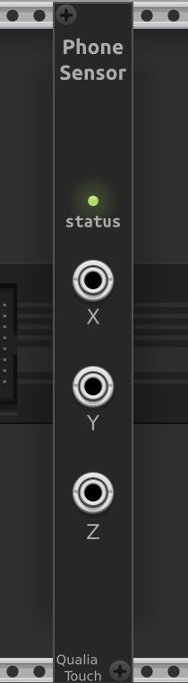

# QualiaSense - a VCV Rack plugin for sensing

## About

QualiaSense is a VCV Rack 2 plugin with a module allowing to get data from real-life sensors.

QualiaSense is part of the QualiaTouch project. QualiaTouch is about giving the machine perception and action capabilities with the outside world.

## PhoneSensor module

The PhoneSensor module retrieves sensor data from a smartphone, and transforms it into CV signals. It requires the use of the PhyPhox app. Configuration and usage are described in the [documentation](doc/phonesensor.md) page.

## Contributing

Contributions are much welcome! Especially from C++ experienced people, who'll know how to optimize the execution, clean the code, and most importantly, prevent memory leaks. Also from svg-friendly people, to improve the module widgets.

## License

As recommended by VCV, QualiaSense is released under the GNU General Public License v3.0 (or later).

This repository also contains the JSON for Modern C++ library by Niels Lohmann, released under the MIT License.

## Thanks

The people who coded VCV Rack and allowed it to be augmented by plugins. And also those who've made the Phyphox app. Also, Dennis Ritchie.
